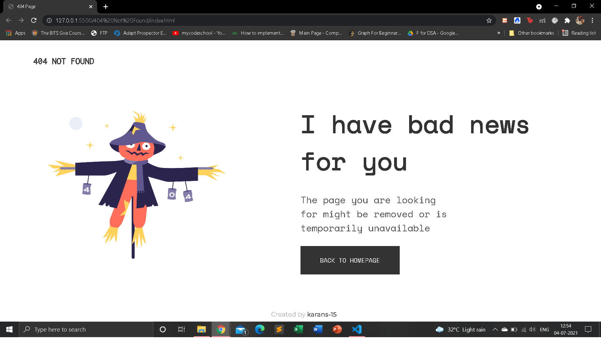

<!-- Please update value in the {}  -->

<h1 align="center">404 Landing Page</h1>

   Solution for a challenge from  <a href="http://devchallenges.io" target="_blank">Devchallenges.io</a>.

  <h3>
    <a href="https://{your-demo-link.your-domain}">
      Demo
    </a>
     | 
    <a href="index.html">
      Solution
    </a>
     | 
    <a href="https://devchallenges.io/challenges/wBunSb7FPrIepJZAg0sY">
      Challenge
    </a>
  </h3>

<!-- TABLE OF CONTENTS -->

## Table of Contents

- [Overview](#overview)
  - [Built With](#built-with)
- [Features](#features)

<!-- OVERVIEW -->

## Overview

Introduce your projects by taking a screenshot or a gif. Try to tell visitors a story about your project by answering:

- Made a 404 Not Found Landing Page using basic HTML and CSS and made it responsive by using Media Queries.

### Built With

<!-- This section should list any major frameworks that you built your project using. Here are a few examples.-->

- [HTML5](https://html.com/)
- [CSS](https://css.com/)

## To run this on your local workspace

 - Copy/Pull the repository maintaining the file structure.
 - Open the index.html file in your browser
